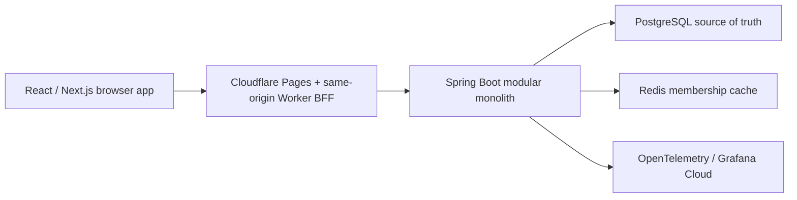

# V-Core architecture

## Runtime



The browser only calls `/api`. In hosted environments the Cloudflare Worker forwards those requests to the configured backend origin. This avoids browser CORS and cookie-domain coupling while retaining the free `pages.dev` frontend URL. Full-stack local development runs the exported site through Wrangler Pages dev, which executes the same BFF contract.

## Backend module boundaries

- `identity`: user identity and authentication adapters.
- `workspace`: memberships, roles, invitations, project/sprint/workflow operations, tenant boundaries, and membership caching.
- `task`: task commands, queries, workflow moves, assignments, comments, and tags.
- `activity`: immutable audit entries, outbox publishing, and realtime streams.
- `shared`: deliberately small cross-cutting primitives only.

Project creation provisions an active sprint and a four-column workflow in one transaction. Workflow-limit changes use optimistic versions; task assignment and comments reuse the same tenant and idempotency boundaries as board commands.

Modules communicate through public application services and domain events. Controllers do not access repositories directly. Persistence entities do not leave the backend boundary.

## Consistency rules

- PostgreSQL owns all durable business state.
- Redis may accelerate a decision but never makes a durable business decision by itself.
- Every write is scoped to a workspace and checked against the authenticated membership.
- Task updates require the version last seen by the client.
- A task move and its WIP-limit check happen in one transaction.
- A business mutation and its outbox record commit in the same transaction.
- Request retries use a client-supplied idempotency key backed by a durable record.

## Repository layout

```text
app/, components/, hooks/, lib/, store/  Next.js frontend
public/_worker.js                         Cloudflare BFF and static asset worker
backend/                                  Spring Boot modular monolith
docs/                                     Product, architecture, API, and evidence
infra/                                    Docker, Helm, and later Terraform
```

## Quality gates

The verification paths run frontend static analysis, unit tests, production builds and Playwright tests; backend formatting plus Testcontainers integration tests; Flyway migration validation; Dockerfile checks/builds; and Helm lint/render checks. CI uses checked-in lockfiles and wrappers so local and hosted builds resolve the same toolchain.
