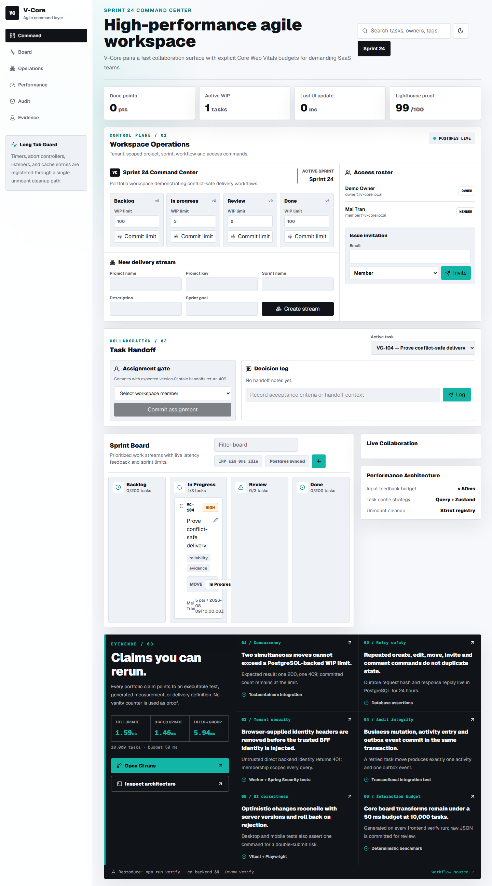
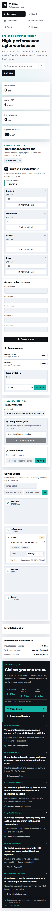

# V-Core evidence index

This directory contains recruiter-facing visual evidence. Executable evidence remains authoritative: screenshots illustrate the product, while CI artifacts contain JUnit, Playwright, performance, and backend integration results.

## Pain-point evidence

| Claim | Executable proof | Expected invariant |
| --- | --- | --- |
| Concurrent moves cannot exceed WIP | `VCoreApplicationTest.concurrentMovesCannotExceedTheTargetColumnsWipLimit` | one `200`, one `409`, committed count equals the limit |
| Retried commands do not duplicate state | backend idempotency integration tests | one task/comment/invitation and one audit/outbox pair |
| Stale edits do not overwrite newer data | version conflict integration tests | stale `expectedVersion` returns `409` |
| Browser identity cannot be spoofed | `tests/cloudflare-worker.test.js` | visitor headers are removed and trusted BFF headers are injected |
| Optimistic UI does not leave ghost data | `tests/task-store.test.ts` | failed command rolls back local state |
| Double-submit does not create duplicates | Playwright desktop/mobile suite | exactly one create command |
| Board operations stay responsive at scale | `reports/performance-proof.json` | all 10,000-task transforms remain below 50 ms |

## Reproduce locally

```powershell
npm ci
npm run verify

cd backend
.\mvnw.cmd verify
```

GitHub Actions uploads two downloadable bundles on every run:

- `frontend-evidence`: performance JSON, Playwright JUnit/HTML, and visual captures;
- `backend-integration-evidence`: Surefire XML and text reports from PostgreSQL/Redis Testcontainers.

## Visual captures

### Desktop



### Mobile


