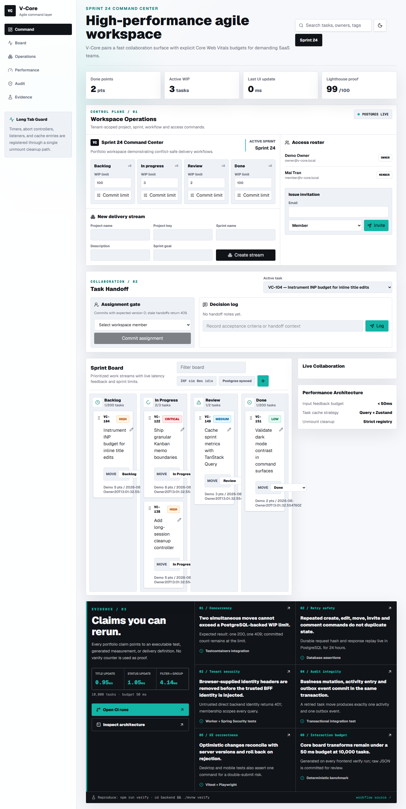
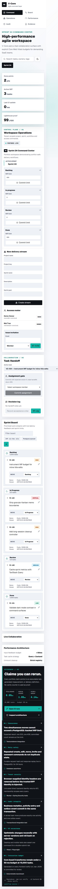

# Live deployment evidence

Validated on 2026-08-20 against the public deployment.

| Layer | Evidence |
| --- | --- |
| Cloudflare Pages + BFF | `https://v-core-saas.pages.dev` returned HTTP 200 |
| Spring Boot readiness | `https://v-core-api.onrender.com/actuator/health/readiness` returned HTTP 200 |
| Trusted session through BFF | `GET /api/session` returned the seeded owner and workspace |
| PostgreSQL-backed workspace | `GET /api/workspaces/{id}/overview` returned HTTP 200 |
| PostgreSQL-backed tasks | `GET /api/workspaces/{id}/projects/{id}/tasks` returned the 5 seeded tasks |
| Retry-safe write path | Two creates with one idempotency key returned the same task ID; task `VC-152` persisted exactly once |
| Browser QA | Chromium desktop and 390×844 mobile passed with no console errors |

The deployed backend source commit was `c95ac29`. Runtime credentials are held only by Render and Cloudflare; the browser receives neither the BFF secret nor database credentials.

